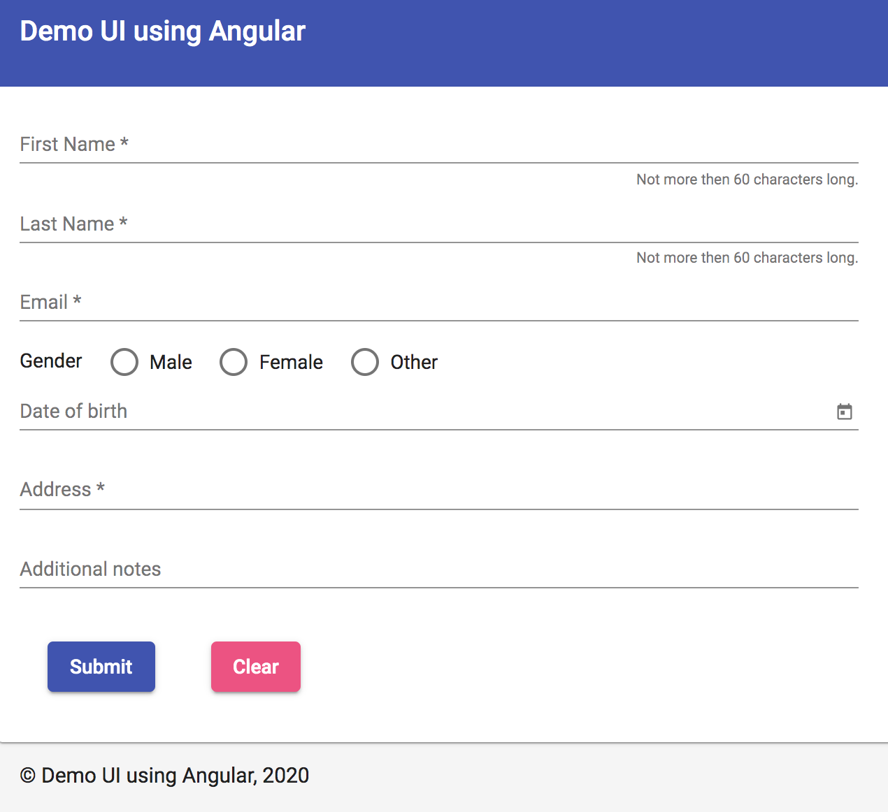

# Demo UI using Angular

This project was generated with [Angular CLI](https://github.com/angular/angular-cli) version 9.1.9.




## Build and run the application
```
npm install
npm run build
```

* The build artifacts will be stored in the `dist/` directory.
* For a prod build use `npm run build-prod`
* For serving the app use `npm run start`


